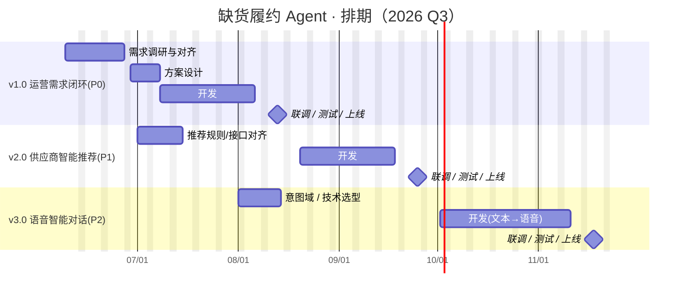
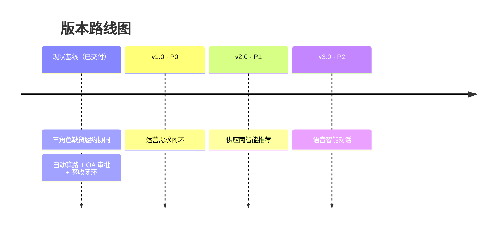

# 缺货履约 Agent · 产品 Roadmap

> 面向研发对接：本文档说明产品侧的版本规划、优先级、待澄清的沟通事项与预估排期，便于研发理解整体方向并据此细化技术排期。
> 维护人：产品 ｜ 最近更新：2026-06-05

---

## 0. 现状基线（已交付 · 当前 Demo）

三角色（运营 / 销售 / 采购）缺货履约协同 MVP，已实现：

- 今日缺货待转单加载与**系统自动算路**（直发 / 正常补货直接进待签收）
- 采购按「品 / SKU」处理（加急 / 延期、供应商、价格、交期、配送方式）
- OA 加一审批 → 写入采购系统 → 签收闭环
- 销售按「酒店」维度查看（待处理 / 延期 / 加急），跟踪签收
- 三角色 KPI / 数据面板

> 业务流程详见 [`业务流程-代码版.md`](业务流程-代码版.md)。本 Roadmap 在此基线上向前规划。

---

## 1. 版本总览

| 版本 | 主题 | 优先级 | 目标 | 预估周期 | 目标上线 |
|---|---|---|---|---|---|
| **v1.0** | 运营需求闭环 | **P0（最高）** | 补齐运营角色的完整业务诉求，打通端到端闭环 | ~7 周 | 2026-07 底 |
| **v2.0** | 供应商智能推荐 | **P1** | 把当前 mock 单一供应商升级为可解释的智能推荐 | ~6 周 | 2026-08 底 |
| **v3.0** | 语音智能对话 | **P2** | 让保留的对话框真正可用：自然语言提问 + 文本/语音交互 | ~7 周 | 2026-10 初 |

> 说明：版本号按「待办优先级」排列；当前已交付部分作为「现状基线」。如需把基线计为 v1.0、待办顺延为 v2.0/v3.0/v4.0，可一键调整，告诉我即可。

---

## 2. 各版本详情

### v1.0 · 运营需求闭环（P0）

**背景**：运营的完整需求尚未沟通清楚，本版本先以**需求调研对齐**开局，再进入设计开发。

**预期范围（待需求对齐后锁定）**：
- 接单 / 邮件解析的人工兜底与待转单核对修订
- 平台订单（叮咚 / 盒马等）人工确认签收的运营闭环
- 运营大盘 / 报表维度（按酒店、按 PO、按品、按城市）
- 运营对履约异常的干预入口

**🔴 待沟通 / 待澄清（阻塞项）**：
1. 运营的核心痛点与高频操作是什么？当前 Demo 缺哪些关键动作？
2. 是否包含退货流程、非结构化订单接入（PRD 标注的 Phase 后续项）？
3. 大盘需要哪些指标维度？是否需要导出 / 推送？
4. 平台订单人工签收的触发与时效要求（T+1 推送？）

**依赖**：运营团队访谈、邮件 Agent / 库存 / 订单系统接口确认。
**验收**：运营可独立完成「接单核对 → 履约跟踪 → 平台签收确认 → 查看大盘」全链路。

---

### v2.0 · 供应商智能推荐（P1）

**背景**：当前 `getPrimarySupplier` 为哈希 mock、仅返回单一供应商；需升级为可解释的推荐。

**预期范围**：
- 三步寻源 UI：系统推荐 Top N → 自联新供应商 → 生鲜平台兜底
- 推荐排序与评分展示（有货状态、历史采购价、供货时效、履约率等）
- 采购选用 / 手动录入，推荐理由可见

**🔴 待沟通 / 待澄清（阻塞项）**：
1. 推荐规则由**益海嘉里系统提供**（Agent 直接消费）还是**本侧自建模型**？（PRD 假设为前者）
2. 可用的数据源有哪些？（历史订单、采购价、时效、有货状态、实时库存？）
3. 推荐数量（Top 3？）、冷启动 / 新品如何处理？
4. 是否需要对接实时库存 / 有货查询接口？

**依赖**：益海嘉里供应商推荐接口或数据，库存/有货查询接口。
**验收**：采购在处理页可见多家带评分理由的推荐，并可一键选用。

---

### v3.0 · 语音智能对话（P2）

**背景**：当前对话框（`MobileAgentThread` / `Composer`）主要做引导与面板展示，未真正承载自然语言问答。

**预期范围**：
- 自然语言提问 → 返回结构化数据面板（今日缺货、最紧急的品、某酒店进度、OA 进度…）
- 交互形态分阶段：**文本优先 → 文本 + 语音（ASR/TTS）**
- 各角色可问的意图域清单（intent set）

**🔴 待沟通 / 待澄清（阻塞项）**：
1. 一期支持哪些问题域 / 意图清单？（先覆盖高频查询）
2. 是否接入 LLM？还是规则 / 意图识别？
3. 语音是否必需？（企微语音输入场景）ASR / TTS 供应商选型？
4. 数据安全 / 合规边界（对话可访问的数据范围）

**依赖**：LLM / NLU 能力、ASR/TTS 服务、各业务查询接口（多数已具备聚合函数）。
**验收**：用户可用文本（二期含语音）提问并得到准确的结构化回答。

---

## 3. 排期甘特图

> 排期假设：1 名前端 + 1 名后端为主力，需求/设计与下一版本的「沟通对齐」适度并行。最终排期以研发评估为准。

---

## 4. 版本时间线

---

## 5. 沟通事项汇总（与研发 / 业务对齐清单）

| # | 版本 | 事项 | 对接方 | 类型 | 状态 |
|---|---|---|---|---|---|
| 1 | v1.0 | 运营完整需求与高频动作访谈 | 运营团队 | 需求 | 🔴 待启动 |
| 2 | v1.0 | 退货 / 非结构化订单是否纳入 | 产品 + 业务 | 范围 | 🔴 待定 |
| 3 | v1.0 | 大盘指标维度与导出/推送 | 运营 + 研发 | 需求 | 🔴 待定 |
| 4 | v2.0 | 供应商推荐规则来源（益海嘉里系统 / 自建） | 益海嘉里 | 接口 | 🔴 待确认 |
| 5 | v2.0 | 推荐可用数据源与实时库存接口 | 益海嘉里 | 接口 | 🔴 待确认 |
| 6 | v3.0 | 一期意图清单与是否接 LLM | 产品 + 研发 | 技术选型 | 🟡 待规划 |
| 7 | v3.0 | 语音必要性与 ASR/TTS 选型、合规边界 | 产品 + 安全 | 技术选型 | 🟡 待规划 |

---

## 6. 风险与依赖

- **外部接口依赖**：v2.0 强依赖益海嘉里推荐 / 库存接口；若未就绪，需排「接口封装」单独列项，可能影响排期。
- **需求不确定性**：v1.0 因运营需求未明确，前 2 周为调研期，范围锁定后再确认开发工期。
- **能力依赖**：v3.0 的 LLM / 语音能力选型会显著影响工期与成本，建议尽早预研。
- **并行约束**：甘特图已让「下一版本的沟通对齐」与「当前版本开发」并行，若人力不足需串行，整体顺延约 3–4 周。
