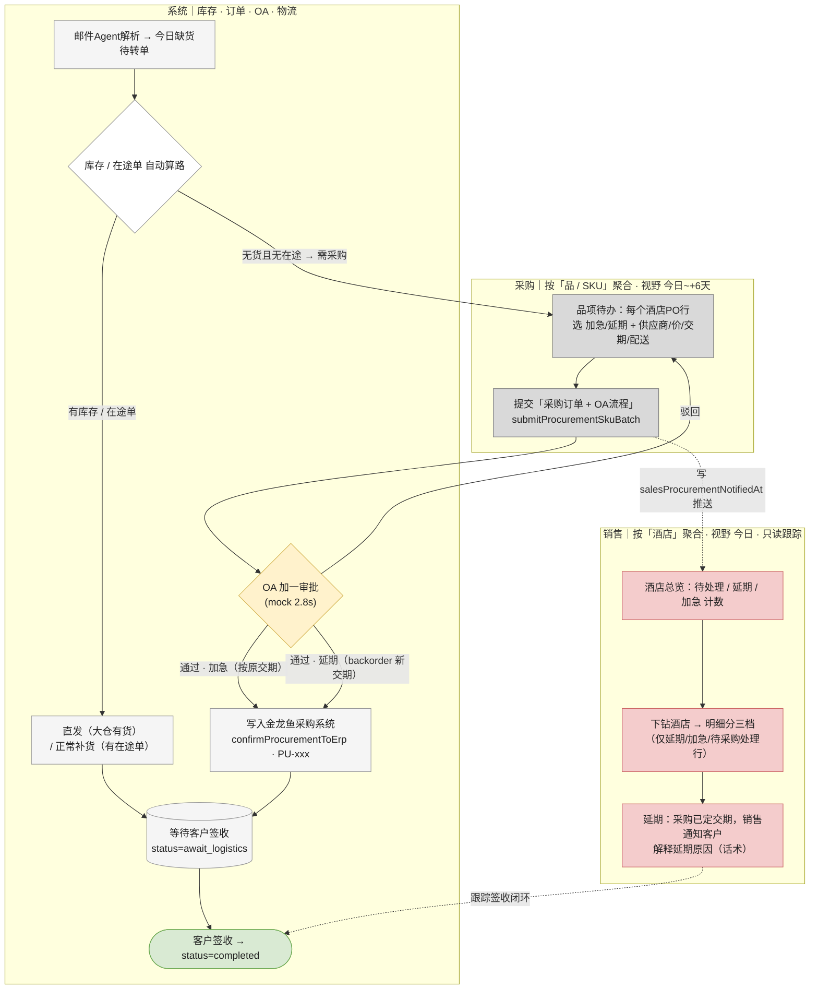
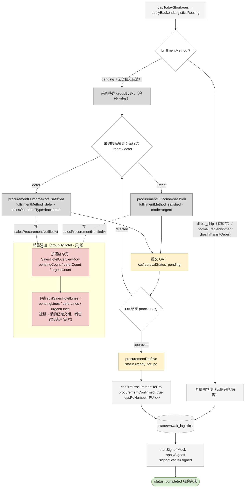

# 业务流程（代码准确版）— 销售 / 采购

> 本文档以**当前代码实现**为准，与 `业务流程.md`（PRD 理想视角）有出入。
> 关键代码：`src/store/shortageStore.ts`、`src/utils/shortageAggregations.ts`、`src/utils/fulfillmentMethodRules.ts`、`src/utils/mobileSalesHotelData.ts`、`src/components/workbench/mobile/MobileProcurementSkuPage.tsx`。

## 与旧版（PRD 视角）的主要差异

1. **接单后系统先「自动算路」**：库存/在途单可满足的缺货行（直发 / 正常补货）直接进入金龙鱼正常物流流程，**不进这个agent，不进采购、不进销售**；只有缺货数据，系统无法自动满足的行才转采购。
2. **顺序是「采购先处理、再通知销售」**：PRD 里「销售先决策履约方式、可打回采购」在 MVP 代码中未实现。
3. **加急与延期都要走 OA 加一审批**：采购表单两种履约方式都需填供应商/价/交期，提交按钮即「确认并提交到采购订单与OA流程」。
4. **数据维度按角色不同**：采购按「品 / SKU」聚合，销售按「酒店」聚合（详见下文）。

---

## 一、核心数据模型

最小单元 = `ShortagePOLine`：酒店 PO 中的一个 SKU 行，即「一条履约任务」。所有流程都是这条记录在改字段。

| 字段 | 取值 | 说明 |
|---|---|---|
| `fulfillmentMethod` | pending / direct_ship / normal_replenishment / satisfied / defer | 履约方式 |
| `procurementOutcome` | pending / satisfied / not_satisfied | 采购处理结果 |
| `oaApprovalStatus` | none / pending / approved / rejected | OA 审批 |
| `procurementConfirmed` | bool | 是否已写入金龙鱼采购系统 |
| `signoffStatus` | pending / signed | 客户签收 |
| `procurementMode` | urgent / normal / pending | 加急 / 常规 |
| `status`（**派生，不手改**） | new / await_procurement / ready_for_po / await_logistics / completed / cancelled | 由 `recomputeLineStatus()` 反推 |

---

## 二、数据维度差异（采购 vs 销售）

| | 采购 | 销售 |
|---|---|---|
| 聚合维度 | **品 / SKU**（`groupBySku`）：同一品下汇总所有酒店 PO 行，统一填一次表 | **酒店**（`groupByHotel`）：酒店总览 → 下钻看该酒店明细 |
| 时间视野 | 今日起 7 日内交期（今日 ~ +6 天） | 仅今日交期（`isDeliveryToday`） |
| 可见范围 | 需采购处理的缺货行（排除已自动算路/已完成） | 仅「被跟踪」行 = 延期 + 加急 + 待采购处理（`isSalesTrackedShortageLine`）；自动算路的直发/正常补货**不展示给销售** |
| 明细分档 | 加急 / 延期 | 待处理 / 延期 / 加急（`splitSalesHotelLines`） |

---

## 三、自动算路（为什么有的行不需要人工）

`applyBackendLogisticsRouting` + 库存系统判定，缺货行分两类：

- **可自动满足 → 直接待签收**：
  - 大仓有库存 → `direct_ship`（直发）
  - 大仓缺货但有在途采购单可按期到货（`hasInTransitOrder`）→ `normal_replenishment`（正常补货）
- **无法自动满足 → 转采购**：既无库存、又无在途单的缺货行保持 `pending`，必须采购人工寻源（选供应商、定价、决定加急/延期）。这就是「需人工」的原因。

---

## 四、采购流程（实际状态流转）

```
pending（系统无法自动满足，进采购待办，按 SKU 聚合）
   │  采购按品填表：每个酒店PO行选「加急 / 延期」+ 供应商/采购价/预计交期/配送方式
   │  提交 submitProcurementSkuBatch（按钮：确认并提交到采购订单与OA流程）
   │
   ├─ 加急 → procurementOutcome=satisfied, fulfillmentMethod=satisfied, mode=urgent
   │
   └─ 延期 → procurementOutcome=not_satisfied, fulfillmentMethod=defer,
   │         salesOutboundType=backorder（按新交期）
   │
   └─→ 两者都进 OA 加一审批：oaApprovalStatus=pending（mock 2.8s 出结果）
          ├─ rejected → 退回采购，修改后重新提交
          └─ approved → 生成草稿号(ready_for_po)
                 → confirmProcurementToErp：写入金龙鱼采购系统 opsPoNumber=PU-xxx
                 → status=await_logistics（加急按原交期 / 延期按新交期）
```

> 实现备注：当前 store 的 `submitProcurementSkuBatch` 中，`defer` 分支暂时把 `oaApprovalStatus` 置为 `none`、未自动触发 `submitOaApprovalBatch`（仅 `urgent` 触发）。但按业务定义（PRD Approach 03、OA 进度视图 `groupBySkuOaProgress`、mock `oaSubmittedDeferLine`、表单按钮文案）**延期同样需要走 OA**。本图以业务定义为准，开发实现需补齐 defer 分支的 OA 触发。

---

## 五、销售流程（按酒店维度 · 只读跟踪）

store 中无任何由销售触发的状态写操作，销售只查看与协调。

```
采购提交（加急或延期）→ 写 salesProcurementNotifiedAt
   → 销售首页「按酒店总览」（groupByHotel）：每家酒店显示 待处理/延期/加急 计数
      → 点选酒店下钻明细，分三档（splitSalesHotelLines）：
           · 待处理   pendingLines
           · 延期     deferLines   ← 采购已确认延期交期，销售据此通知客户（解释延期原因，考验话术）
           · 加急     urgentLines
   销售视角只跟踪签收闭环，不改履约记录状态
```

---

## 六、汇合与完成

自动算路 / 加急已确认 / 延期 三条路径最终都到 `await_logistics`，
由 mock 定时器 `startSignoffMock`（每 12s）自动 `applySignoff`
→ `signoffStatus=signed` → `status=completed`。

---

## 七、流程图 · 角色泳道版（销售 + 采购合一）



---

## 八、流程图 · 开发版（含字段变更）


