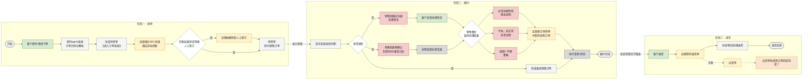

```mermaid
flowchart LR
    %% ========= 样式 =========
    classDef customer fill:#D9EAD3,stroke:#6AA84F,stroke-width:1.5px,color:#222;
    classDef ops fill:#FFF2CC,stroke:#D6B656,stroke-width:1.5px,color:#222;
    classDef sales fill:#F4CCCC,stroke:#CC6666,stroke-width:1.5px,color:#222;
    classDef purchase fill:#D9D9D9,stroke:#7F7F7F,stroke-width:1.5px,color:#222;
    classDef system fill:#F5F5F5,stroke:#999999,stroke-width:1.5px,color:#222;
    classDef decision fill:#FFFFFF,stroke:#999999,stroke-width:1.5px,color:#222;
    classDef note fill:#FCE5CD,stroke:#E69138,stroke-width:1px,color:#222;

    %% ========= 阶段一：接单 =========
    subgraph P1["阶段一：接单"]
    direction TB
        A0([开始]):::system
        A1["客户邮件/微信下单"]:::customer
        A2["邮件agent系统\n订单识别与解析"]:::system
        A3["生成待转单\n【进入订单系统】"]:::system
        A4["运营核对SKU信息\n酒店非标匹配"]:::ops
        A5{"匹配结果是否需要\n人工修订"}:::decision
        A6["运营依据经验人工修订"]:::ops
        A7["待转单\n转为销售订单"]:::system

        A0 --> A1 --> A2 --> A3 --> A4 --> A5
        A5 -- 是 --> A6 --> A7
        A5 -- 否 --> A7
    end

    %% ========= 阶段二：履约 =========
    subgraph P2["阶段二：履约"]
    direction TB
        B1["库存系统校验判断"]:::system
        B2{"是否缺货"}:::decision

        B3["销售和酒店沟通\n处理意见"]:::sales
        B4["销售和采购确认\n到货时间/备货计划"]:::sales

        B5["客户反馈处理意见"]:::customer
        B6["采购反馈补货信息"]:::purchase

        B7{"销售整合\n最终处理结果"}:::decision

        B8["必须当期到货\n紧急采购"]:::sales
        B9["不急，走正常\n补货流程"]:::sales
        B10["延期 / 平替\n策略"]:::sales

        B11["运营修订待转单\n并制作采购订单"]:::ops
        B12["形成最终销售订单"]:::system
        B13["执行采购/供货"]:::purchase
        B14([履约完成]):::system

        B1 --> B2
        B2 -- 是 --> B3
        B2 -- 是 --> B4
        B3 --> B5 --> B7
        B4 --> B6 --> B7

        B7 --> B8
        B7 --> B9
        B7 --> B10

        B8 --> B11
        B9 --> B11
        B10 --> B11

        B11 --> B13 --> B14
        B2 -- 否 --> B12 --> B13
    end

    %% ========= 阶段三：退货 =========
    subgraph P3["阶段三：退货"]
    direction TB
        C1["客户退货"]:::customer
        C2["运营制作退货单"]:::ops
        C3["出货单"]:::ops
        C4["仓库/物流处理退货"]:::system
        C5([退货结束]):::system
        C6["出货单和采购订单的区别是？"]:::note

        C1 --> C2 --> C4 --> C5
        C2 -. 关联 .-> C3
        C3 -.-> C6
    end

    %% ========= 阶段间关系 =========
    A7 -->|"进入审核"| B1
    B14 -. "仅异常情况下触发" .-> C1
```