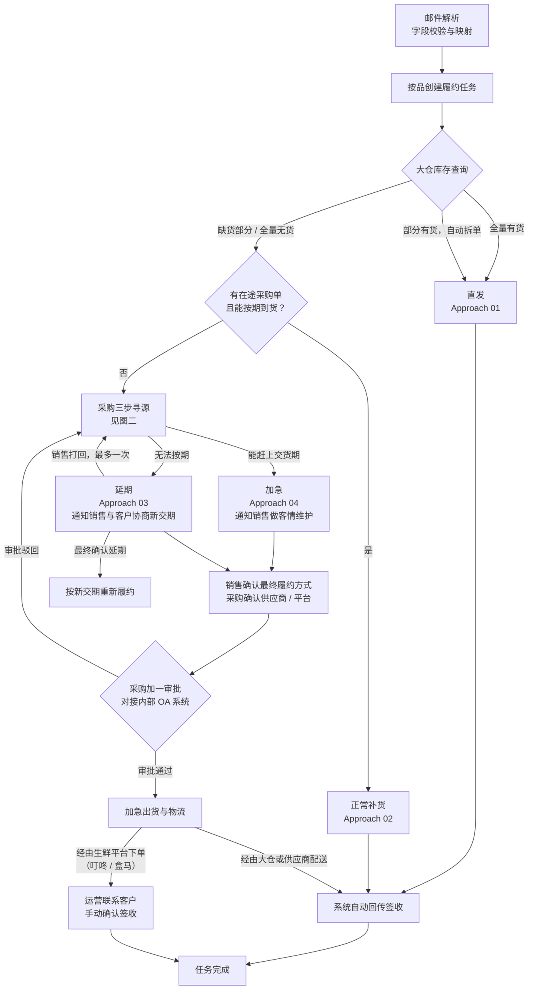
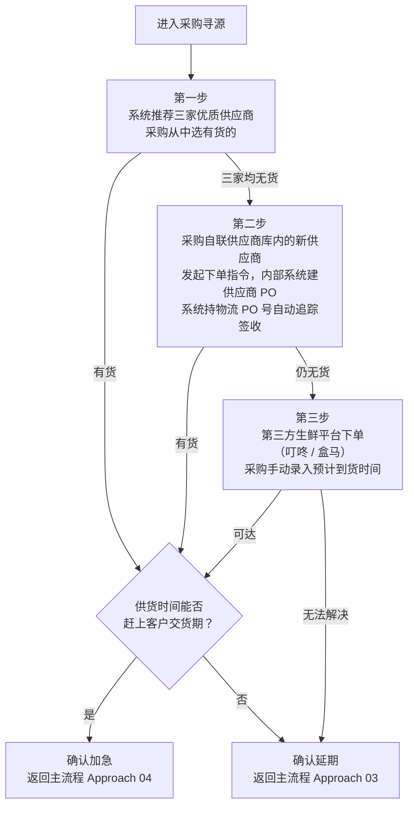

# 缺货履约 Agent — MVP PRD

## 1. 产品概述

**产品名称**：缺货履约 Agent  
**定位**：面向运营、销售、采购三个角色的主动运营型任务协同 Agent。将缺货品的履约过程按"品"拆解为独立任务，驱动三个角色在各自环节完成操作，并实时推送任务进度。  
**部署形态**：企业微信独立应用，移动端优先  
**MVP 城市范围**：单城市验证  
**并发规模**：MVP 约 100 行/天；架构按 1500–2000 行/天设计，支持后续扩展至 15 城市

---

## 2. 用户角色


| 角色  | 核心职责                          |
| --- | ----------------------------- |
| 运营  | 接单、创建履约任务；平台订单签收人工确认；查看整体大盘   |
| 销售  | 按品确认履约方式；与客户协商延期（Approach 03） |
| 采购  | 库存判断、供应商寻源、录入到货时间；提交 OA 审批    |


---

## 3. 核心概念

- **履约任务**：以"品"为最小单元，一个酒店下单 PO 中每个 SKU 对应一条独立履约任务
- **任务完成标准**：客户签收时间；全部子任务完成才视为该品履约完成
- **拆单场景**：大仓部分库存时，同一品拆为多条子任务，分别走不同 Approach，子任务全部完成才算整体完成

### PO 术语说明

| 术语 | 含义 |
|------|------|
| 酒店下单 PO | 酒店客户下给益海嘉里的采购订单，由邮件 Agent 解析后进入本系统 |
| 供应商 PO | 益海嘉里下给供应商的采购订单，由益海嘉里内部系统生成；Agent 触发下单动作，接收回传的 PO 号 |
| 物流 PO | 大仓或供应商配送环节中用于追踪签收状态的 PO 单号（即供应商 PO 号在物流场景下的称谓） |

---

## 4. 主流程

### 图一：主流程



### 图二：采购三步寻源




---

## 5. 五种 Approach 定义


| Approach | 触发条件 | 订单类型 | 签收方式 | 需要企业审批 |
|----------|---------|---------|---------|---------|
| 01 直发 | 大仓有库存，直接出库 | OrderDirect | 系统自动回传 | 否 |
| 02 正常补货 | 大仓缺货，但已有在途采购单可按期到货 | Backorder | 系统自动回传 | 否 |
| 03 延期 | 寻源后仍无法在客户交货期前到达，需下新采购单 | Backorder（新交期） | 系统自动回传（按新交期） | **是** |
| 04 加急 | 寻源后能赶上客户交货期，需下新采购单 | Backorder | 视供货渠道而定 | **是** |
| 05 产品平替 | ❌ MVP 不做 | — | — | — |


---

## 6. 采购寻源细节（Approach 03 / 04）

### 寻源三步流程

1. **第一步 — 系统推荐**：系统推荐三家优质供应商（内部评分规则），采购从中选有货的，在 Agent 中确认并发起下单指令。实际供应商 PO 由益海嘉里内部系统生成，Agent 接收回传的物流 PO 号，通过该号追踪签收状态，客户签收后自动回传，无需手动录入时间。
2. **第二步 — 自联新供应商**：三家均无货时，采购从供应商库中自联其他供应商，在 Agent 中录入信息并发起下单指令。签收追踪方式同第一步，由益海嘉里内部系统建立供应商 PO，Agent 持物流 PO 号自动回传，无需手动录入时间。
3. **第三步 — 生鲜平台兜底**：仍无货时，采购从叮咚/盒马等第三方生鲜平台下单。平台订单不产生供应商 PO，无法通过物流 PO 号自动追踪。系统在 T+1 时向运营推送任务，由运营联系客户确认签收后手动标记完成。不做平台 API 对接。

### 销售打回规则

- 销售认为客户无法接受延期时，可打回采购要求重新寻源，**最多 1 次**
- 采购第二次判断后结果为终态，不再接受打回
- 若最终仍为延期，销售负责与客户确认新交期

### 采购加一审批

- 销售确认最终履约方式、采购确认供应商或平台后，由采购触发审批
- 审批流程由益海嘉里内部 OA 系统执行，Agent 不介入审批过程
- Agent 接收审批结果回传：`ApprovalStatus = Approved / Rejected`
- 驳回 → 重新回到采购三步寻源

---

## 7. 签收与任务完成

### 7.1 自动签收（大仓物流 / 供应商配送）

适用于 Approach 01（直发）、Approach 02（正常补货）、Approach 04（加急 — 经由推荐供应商或自联供应商）。

采购在 Agent 中发起下单指令后，益海嘉里内部系统生成供应商 PO 并回传物流 PO 号。供应商持物流 PO 号让客户签收，系统自动回传签收状态，Agent 监听后自动标记任务完成。采购无需手动录入到货或送达时间。

### 7.2 人工签收（生鲜平台订单：叮咚 / 盒马）

适用于 Approach 04（加急 — 经由第三方生鲜平台下单）。

平台订单不在 PO 管理体系内，无法通过单号自动追踪。处理流程：

1. 采购完成平台下单后，系统在 T+1 时向**运营**推送确认任务
2. 运营联系客户确认是否已签收
3. 运营在 Agent 中手动标记"客户已签收"
4. 任务完成

> **注意**：采购通常在平台下单 2–3 天后才补录 PO 单，不能等 PO 补录后再判断完成，必须以运营手动确认时间为准。

### 7.3 任务完成标准

所有 Approach 统一以**客户签收时间**作为该品履约任务的完成时间。一个品下所有子任务（拆单场景）全部完成，该品才算完成。

---

## 8. 主动推送逻辑（按小时）

### 运营

- 今日已同步 PO 数 / 总缺货品数 / 缺货 PO 解析率
- 整体 Pipeline 进度（各阶段完成 / 待完成品数）
- 按酒店视角：各酒店完成品数、未完成品数、预计完成时间
- 按 PO 视角：各 PO 下品的完成进度
- 待人工确认签收任务列表（平台订单）

### 销售

- 今日待确认履约方式品数 / 已完成数
- 各品的 Agent 履约建议（含判断理由：能否按期、建议加急或延期）
- 打回采购后的最新寻源结果通知

### 采购

- 待提供履约建议品数 / 已完成数
- 待寻源任务列表（按优先级排序）
- OA 审批结果通知（Approved / Rejected）
- 销售打回任务提醒

---

## 9. 数据视角与聚合

数据以**品**为最小追踪单元，向上支持两个聚合维度：

```
酒店
 └── PO（采购订单）
      └── 品（SKU，独立履约任务）
           └── 子任务（拆单场景）
```

各角色可切换视角查看完成度，所有维度完成率从品级向上滚动汇总。数据模型含**城市字段**，支持后续按城市过滤统计（无需多租户改造）。

---

## 10. MVP 范围边界

### ✅ MVP 内

- Approach 01–04（直发、正常补货、延期、加急）
- 拆单逻辑（部分库存自动拆分子任务）（**单独列项**）
- 采购三步寻源 + 手动录入
- OA 审批结果回传（Approved / Rejected）
- 系统自动签收回传（大仓 / 经销商）
- 运营人工确认签收（平台订单）（**单独列项**）
- 企微 App 移动端三角色工作台
- 主动推送（按小时，三角色）
- 按品追踪 + 按 PO / 酒店聚合视图
- 单城市验证（数据模型含城市字段）

### ❌ MVP 外

- Approach 05 产品平替（Phase 3）
- 退货流程（Phase 4）
- 非结构化订单接入（Phase 2）
- 平台（叮咚 / 盒马）API 对接
- 多租户 / 城市隔离
- Web UI

### 📋 单独列项（条件触发）


| 项目                | 说明                    |
| ----------------- | --------------------- |
| 邮件 Agent 字段二次解析兜底 | 若上游无法提供结构化 JSON，需额外处理 |
| OA 系统 API 封装      | 若益海嘉里未提供现成接口，需自行封装     |
| 15 城市数据扩展         | 城市字段过滤 + 统计，无需多租户改造   |
| Web UI            | 移动端完成后可选追加，复用后端接口     |


---

## 11. 关键假设

1. 益海嘉里提供库存系统、订单系统、OA 系统的 API 文档及联调支持
2. 邮件 Agent 优先输出结构化 JSON；字段不匹配时有人工介入兜底
3. 销售打回采购最多 1 次，第二次采购判断为终态
4. 平台订单（叮咚 / 盒马）不做 API 对接，采购手动录入到货时间
5. 任务完成以客户签收时间为准，平台订单由运营人工确认
6. MVP 部署于企业微信，不使用飞书
7. 不同城市销售 / 运营 / 采购为同一批人，无需多租户隔离
8. 供应商推荐规则（Top 3 评分逻辑）由益海嘉里系统提供，Agent 直接消费推荐结果，不参与规则计算

